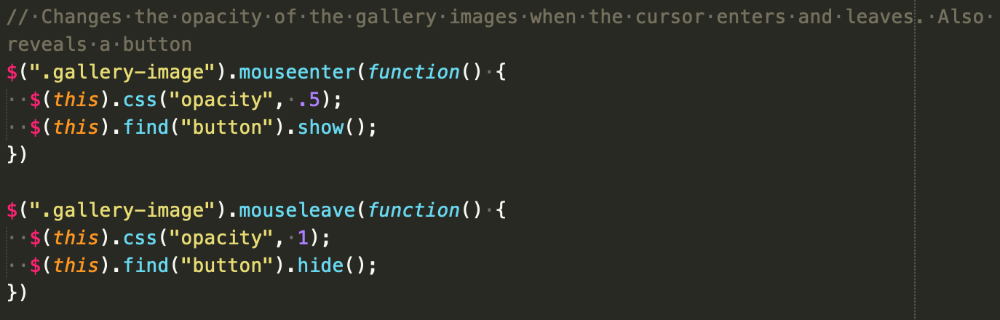

# Project 0
https://awang617.github.io/

## Technologies Used
I used HTML, CSS, Javascript, Bootstrap, and jQuery.

## My approach
My approach to the project was to first lay out where the content would all go. I set up the sections I would need for my page. Then I looked on Bootstrap's documentation for the grid layout and components I might need for my page and implemented it to my HTML. Once I had the layout close to how I wanted, I began to add style to the elements and changing the various images and background.

## Challenges and Wins
Some challenges with this project were getting the testimonial quotes to fade in and out. I used the fadeIn and fadeOut functions from jQuery, but I wasn't able to find a way to cycle through a different set of quotes. I ended up hearing about a solution from Leo on Stack Overflow. It uses a function that grabs all the testimony quotes from the document and cycles through them by index number. The quote shows for ten second and then shows the next one. The function uses a modulus to continue cycling through the quotes after it goes through the entire list.

A feature I am excited about is getting a button to appear and disappear to open the modal. It took some time to figure out which selector I had to call in order to target the right button.

## Unsolved Problems
I would like to find a way to better implement the heading image. The image is not fully responsive at every ratio and it would be nice to display it better. I would also like to find a way to implement a carousel in the modal.

